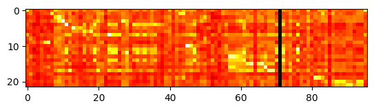
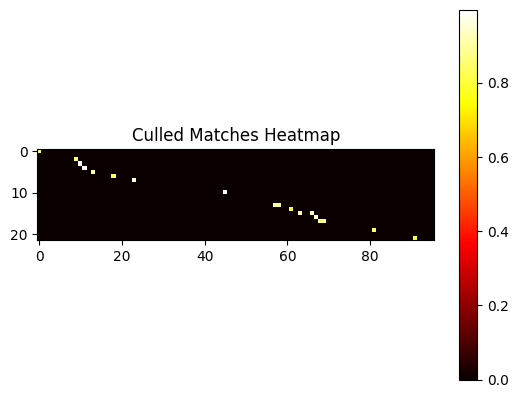

# Video Summarizer Concept
This app summarizes a video by using whisper to transcribe the video then and LLM to summarize it. Then we segments from whisper to compare against each line from the summary. Then we select the closest matches and clip those with FFMPEG into a new video.

## A cool visual of summarization

We can see there is a bright path that follows a meandering diagonal from the top left to the bottom right. The wide axis represents the embeddings from the original transcript and the tall axis is the summary embeddings. The matches shown in bright yellow and white, are the clips we take from the original to reconstruct an approximate summary.

Here's a processed version to highlight and isolate the hotspots even more:

## TODO
Increase timestamp accuracy.

See plan.md for more TODOs.

Test with more realistic videos and add support for multiple input videos.